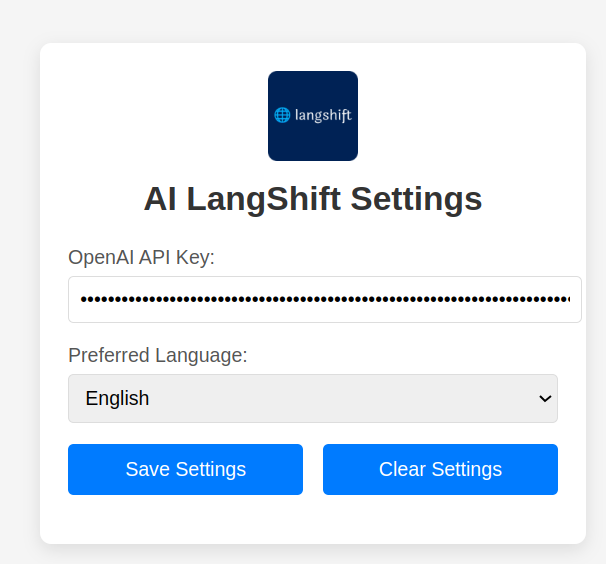

# AI LangShift

AI LangShift is an open source Chrome extension that instantly translates user-selected text on any webpage using the OpenAI API (GPT-4). With a simple keyboard shortcut, the extension retrieves the selected text, sends it for translation, and replaces it directly on the page.

## Features
- **Instant Translation:** Translate selected text with a single keyboard shortcut.
- **Customizable Settings:** Configure your OpenAI API key and preferred target language via the options page.
- **Wide Compatibility:** Works on standard webpages as well as in input fields and contenteditable elements.
- **Open Source:** Fully open source and hosted on GitHub, encouraging community contributions.



## Table of Contents
- [Installation](#installation)
- [Building & Development](#building--development)
- [Testing](#testing)
- [Usage](#usage)
- [Contributing](#contributing)
- [License](#license)

## Installation
1. **Clone the Repository:**
   ```bash
   git clone https://github.com/imaun/langshift.git
   cd langshift
   ```
2. **Install Dependencies:**
    ```bash
    npm install
    ```
3. **Build the Extension:**
    ```bash
    npm run build
    ```
    This command compiles the TypeScript files and copies static assets (HTML, CSS, manifest, icons) into the `dist` directory.

## Building & Development

- **TypeScript Compilation:**
The project is written in TypeScript. To compile the code, run:
    ```bash
    npx tsc
    ```

- **Automatic Build Script:**
The build process includes a script that copies all static assets to the dist folder. Run:

    ```bash
    npm run build
    ```

- **Development Workflow:**
Make changes in the `src` folder and re-run the build script to see your updates reflected in the `dist` directory.

## Testing
1. **Load the Extension Locally:**
    - Open Chrome/Brave and navigate to `chrome://extensions/`.
    - Enable **Developer Mode**.
    - Click "Load unpacked" and select the `dist` folder.
2. **Set your OpenAI API key:**
    - From the extensions page, click **"Details"** on the AI LangShift extension.
    - Click **"Extension options"** to open the settings page where you can enter your API key and choose your target language.
3. **Verify Functionality:**
    - Open any webpage.
    - Select some text.
    - Press the configured shortcut (default is `Alt+Shift+T`).
    - The selected text should be replaced with its translated version.

## Usage
- **Translate Selected Text:** 
Simply select text on a webpage and press the shortcut key to have it translated and replaced.
- **Configure Settings:**
Open the extension’s options page to set your OpenAI API key and target language.

## Contributing
Contributions are welcome! If you have suggestions or improvements, please open an issue or submit a pull request on the GitHub repository.

## License
This project is licensed under the [GPLv3 License](LICENSE).
